# The Ashlar

The Ashlar is our custom engineered ESP32 mining device. It comes from the factory pre flashed. All you have to do is plug it in, set up the Wifi, and provide your solana address.

## Prerequisites
* An android or apple mobile phone
* A 2.4 GHz Wifi network with internet access.
**NOTE: Many Wifi networks are configured by default to run a 2.4 GHz and a 5 GHz network with the same network name. This may cause failure to identify the network or failure to join the network in some cases. If you have issues connecting to your Wifi network we recommend creating a stand alone 2.4 GHz Wifi network with a unique name. This is a limitation of ESP devices and outside of our control**
* An Ashlar
* A Solana Wallet

If you are using a computer you will need a wallet plug-in installed in your browser of choice. Chrome seems to be the most trouble free. We support Phantom, Solflare, and Backpack wallet plug-ins. The use of a ledger device is supported with the phantom wallet. Other device \ wallet combos may also work. Such information can be found in the discord. Be aware that using a hardware wallet will slow down the claims process slightly.

On mobile devices, you will need to use the browser built into the wallet app. Claiming directly from a normal browser on a mobile device does not work. We support Phantom, Solflare, and Backpack wallets.

## Configuration

1. Carefully unbox your Ashlar. **If you purchased more than one, please unbox and configure them one at a time.**
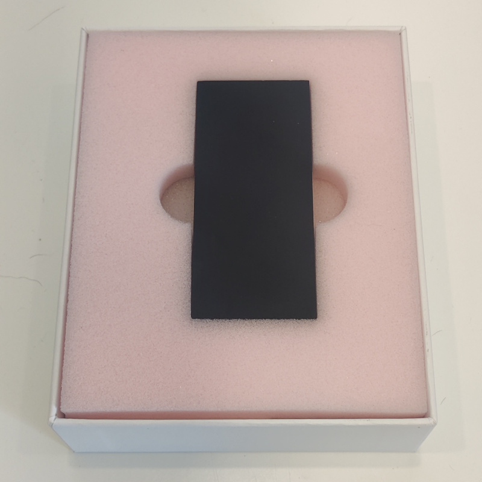

2. Insert the Ashlar into the base. It only fits into the base in one orientation (as illustrated below). Do not try to force it in place. Then plug the base into the wall using the provided power supply and *power only* cable. It will greet you by gently pulsing its LEDs. Say good morning.
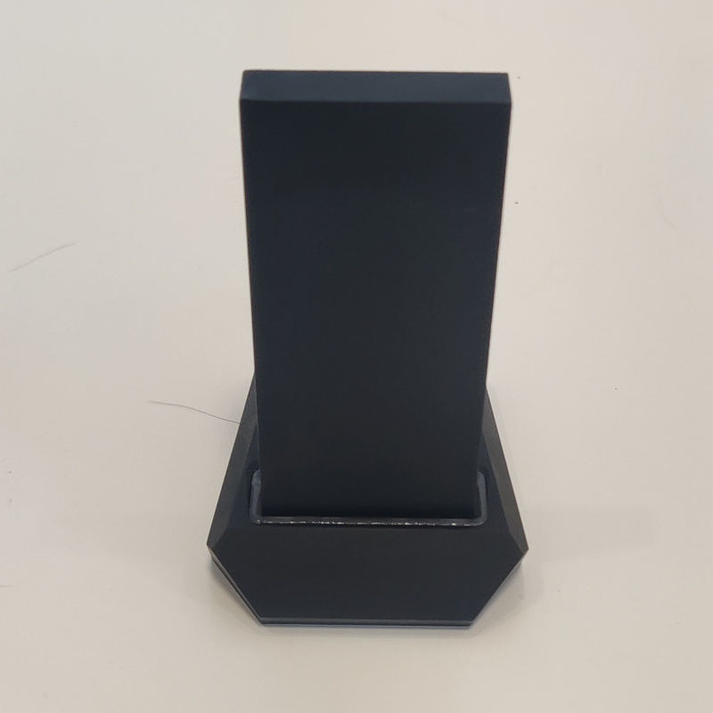

3. Download the Entropy app from the Apple App store or the Google Play Store. The iOS app is currently in public beta on Testflight and can be downloaded [here](https://testflight.apple.com/join/VHttnEXp). The Andriod app is currently in private beta. Please email info@puredepin.com for an invite link.

4. Create a **NEW** solana wallet that will be used exclusively for this Ashlar.

5. Turn on your phone's bluetooth radio.

6. Launch the app.

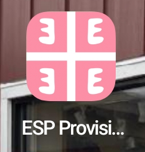

7. Tap the Entropy logo to start the provisioning process.

8. Select Ashlar from the list of available devices.

9. Enter the address of your new solana wallet and hit submit.

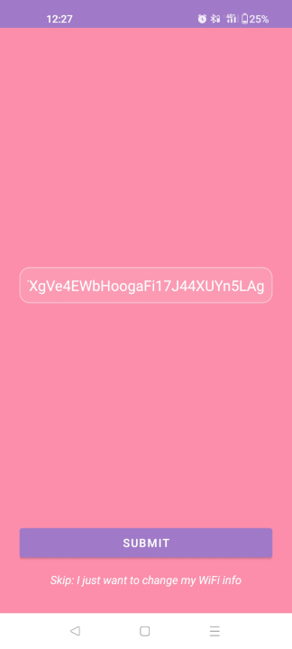

10. Select your Wifi network and enter the password when prompted.

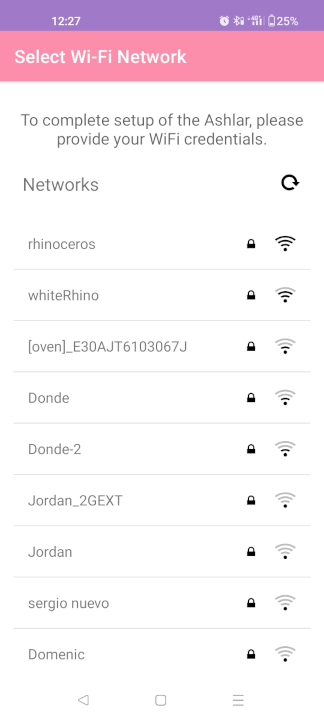

11. The LEDs will pulse green if the Ashlar connected to your Wifi network successfully. If not, the LEDs will turn red. If the process failed, go back to step 7 and repeat.

12. The last step in the process is to make your first claim. In order to verify that your device is functioning we have gifted you ~1000 ENT. This amount becomes available when your Ashlar registers itself. When you claim your 1000 ENT, your Ashlar will be permenantly tied to you wallet address. Dont lose track of this wallet as it is required to claim. 

**Before attempting to make your first claim, please make sure you have some SOL in your mining wallet.**

### Claiming from a computer
a) Unlock your wallet

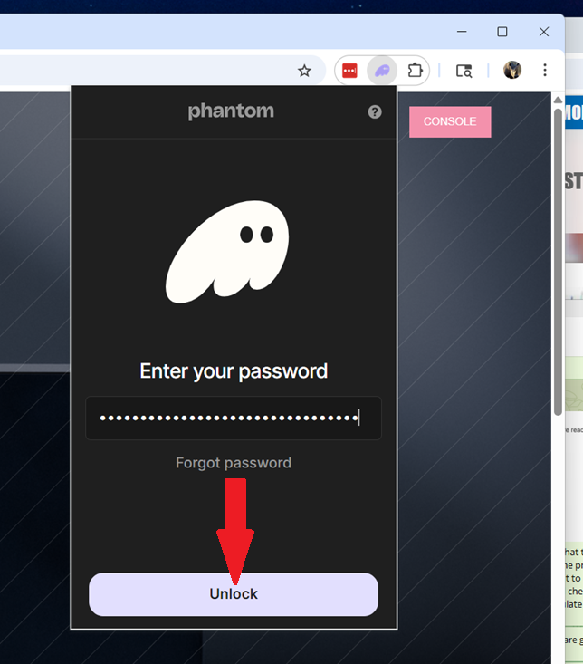

b) Select the wallet you used to register your Ashlar

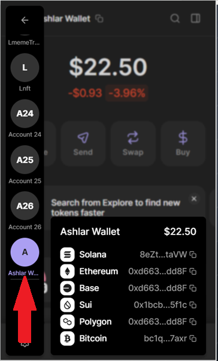

c) Point your browser to justentropy.lol

d) Select console in the upper right corner

e) On the console page, select the claim button

f) Click confirm

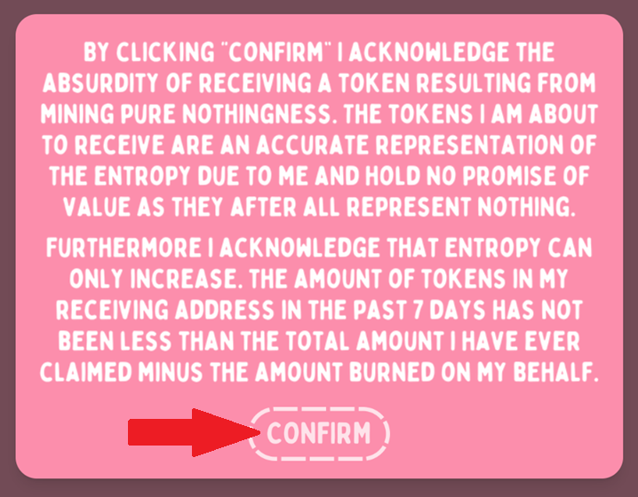

g) Sign the transaction

### Claiming from a mobile device ###

a) Open your wallet app (Phantom in this case)

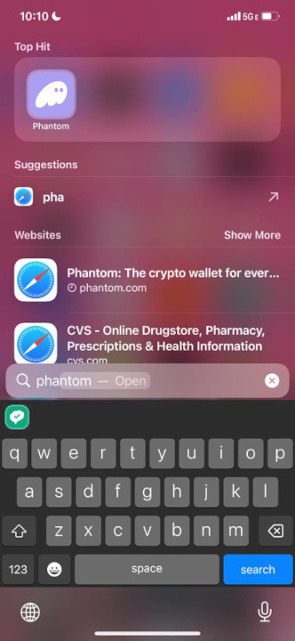

b) Select the wallet you entererd when you registered your ashlar

c) Hit the search button

d) Enter "justentropy.lol" in the search box

e) Hit the console button

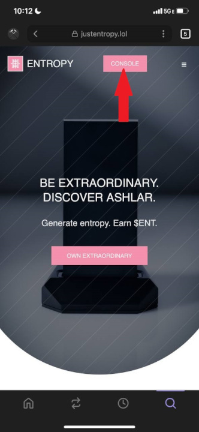

f) On the console page, hit claim

g) Read the disclaimer and hit confirm 

h) Sign the transaction

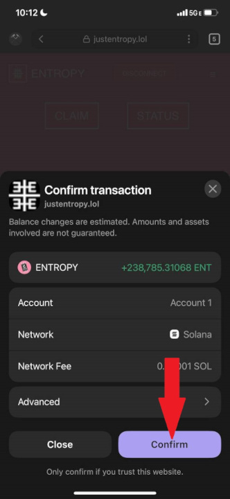

 **If there is nothing to claim it means that you entered your wallet address incorrectly. Please proceed to Reprovisioning to rectify this situation.** 

13. Setup is now complete. A few items to note:

* The pairing between your Ashlar and your mining wallet is permenant. Even if you attempt to change it by reprovisioning (after your first claim) the system will ignore the new address. 
* Please leave your Ashlar plugged in to a constant power source such as the one that came in the package. Do not leave it connected to a computer as these often shut off power to USB ports to save power. Frequent power cycling of the Ashlar will lower your earnings.
* Your Ashar will send us nothing approximately once an hour, at which time it will emit a pink pulse of light. 
* After a few hours you can check the status of your device on the [console](https://justentropy.lol/console)
* The red LEDs will come on if the Wifi connection is lost.

## Reprovisioning

You can change the Wifi network your Ashlar is connected to. If you have not yet claimed on your new wallet you can also submit a new wallet address. If you entered your solana wallet address incorrectly, this process provides a mechanism to correct it before the a wallet address is permanantly associated with your Ashlar.

To start the reprovisioning process, insert a paperclip into the hole on the side of the device. Depress the button and hold it down for 5s. The LEDs will turn blue. They will then turn red, after which you can remove the paperclip. Then follow the provisioning instructions starting at step 5.

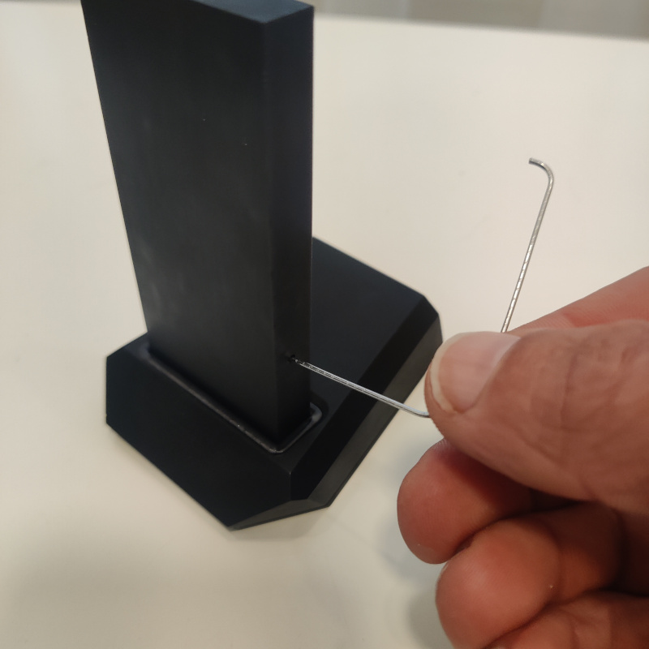

