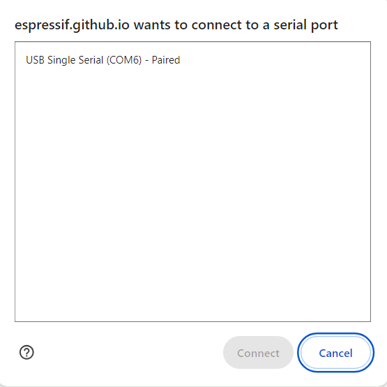
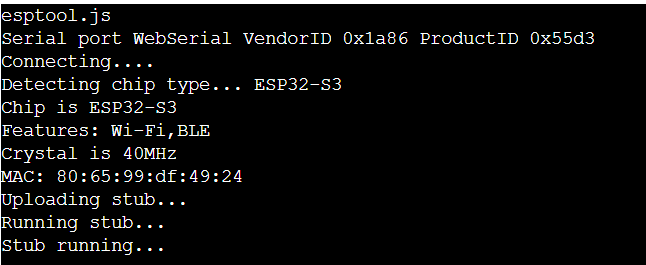

# Web Based Programming

Instructions to onboard your DIY miner using the ESP Tool web interface

### Prerequisites
* A web browser

### Guide

### Step 1: Download your firmware file and note its location in your filesystem
* The filename will look something like `ENTROPY_ww_xxxxx_yyyyyy_zzzz.bin`.
* `w`, `x`, `y`, and `z` will be unique to your file.

### Step 2: Plug your board into your computer

* Some boards have one USB connectors and other have 2. On boards with 2 connectors, either will work.

### Step 3: Open your browser

* Navigate to https://espressif.github.io/esptool-js/

### Step 4: Connect to the serial port

* You may need to install a driver to allow the board to communicate with your computer
* Instructions are [here](https://docs.espressif.com/projects/esp-idf/en/v5.2.2/esp32s3/get-started/establish-serial-connection.html)

* Under the program heading, click on the connect button
    * Leave the baud rate set to 115200.

* Select the COM port corresponding to your device
    * In general, there will only be one option available. If there are multiple and you are
    unsure which to select, close the window, unplug your board, then click on the `Connect` button again
    and note which port disappeard. Close the window again, plug the board in, select that port, and
    click on the `Connect` button.

* After you click on the `Connect` button, the console will display some information if you have
connected succesfully.

### Step 5: Erase the flash

* Under the program heading, click on the `Erase Flash` button

### Step 6: Set the flash address

* By default the address is set to 0x1000. Change it to 0x0000

### Step 7: Click on the `Choose File` button and select the file you downloaded in step 1

### Step 8: Click on the `Program` button

* You will see output in the console window. When the programming operation is complete
it should look something like the following:

### Step 9: Click on the `Disconnect` button

### Step 10: Verify that the firmware was loaded correctly 

* Under the `Console` heading, click on the `Start` button

* Select the same serial port that you selected in step 4
* Click on the `Connect` button
* Click on the `Reset` button
* If the programming operation was succesful, you should see output on the
serial console as follows:

* You can leave the console connected to monitor the firmware's response to the 
remaining steps

### Step 11: Connect to WiFi [ESP32 boards only support the 2.4GHz band]

* Download an ESP WiFi config app from your app store
  * The following have been tested
    * [Android](https://play.google.com/store/apps/details?id=com.techbot.smart_config)
    * [IOS](https://apps.apple.com/us/app/smartconnect-for-esp/id1592092325)

* Connect your phone to your WiFi access point

* Open the app and share the password with the device

### Step 12: Set it and forget it

* Monitor the device using the serial console for as long as you like

* Disconnect and plug the device to a 5V power source
  * Any USB adapter should work
  * Average current draw will be about 20mA, spiking to about 0.5A when connecting to WiFi, i.e., the power consumption is about 0.1W
